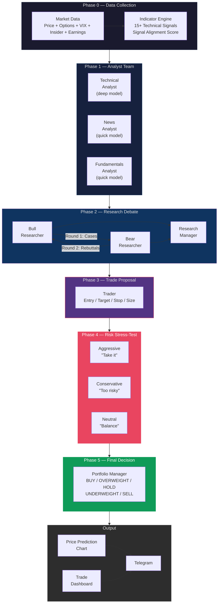

<div align="center">

# DayTradeAgents

### Multi-Agent LLM Day Trading Framework

*11 AI agents that debate, challenge, and stress-test every trade before you take it.*

[](https://www.python.org/downloads/)
[](https://openai.com/)
[](https://anthropic.com/)
[](https://core.telegram.org/bots)
[](https://opensource.org/licenses/MIT)

---

**11 Agents** &nbsp;|&nbsp; **Multi-Round Debates** &nbsp;|&nbsp; **15+ Indicators** &nbsp;|&nbsp; **Price Prediction Charts** &nbsp;|&nbsp; **Telegram Delivery**

Built on ideas from **[TradingAgents](https://github.com/TauricResearch/TradingAgents)** by Tauric Research

</div>

<br/>

## How It Works

DayTradeAgents mirrors how professional trading firms operate. Instead of one AI giving a signal, **11 specialized agents** analyze, debate, stress-test, and synthesize a final decision through a structured 6-phase pipeline.

Send `ta NVDA` to your Telegram bot and get back a **price prediction chart** and a **full trade dashboard** in ~3-5 minutes.

<br/>



<br/>

---

## Key Features

### Multi-Agent Debate Architecture

11 specialized agents collaborate through structured debates. Bull and bear researchers argue in **multiple rounds with direct rebuttals** — not just presenting sides, but attacking each other's specific points. A research manager reads the full transcript and identifies which arguments survived.

### 3-Way Risk Stress-Test

Every trade proposal faces a **risk committee of three personas**:

| Persona | Role | Argues For |
|---------|------|------------|
| **Aggressive** | Risk-taker | Upside justifies the risk — size up, act now |
| **Conservative** | Capital protector | Hidden risks — size down, wait for confirmation |
| **Neutral** | Mediator | Where each side is right and wrong |

### Signal Alignment Score

A composite score from **-100 to +100** computed from all indicators *before* agents begin analysis. This objective anchor reduces the LLM's tendency to cherry-pick signals that confirm the first narrative it encounters.

### 15+ Technical Indicators (All Local)

All computed from free Yahoo Finance data — no paid APIs needed:

| Category | Indicators |
|----------|-----------|
| **Momentum** | RSI (14), Stochastic %K/%D, ROC (12) |
| **Trend** | MACD, EMA 9/21 Cross, ADX (14) |
| **Volatility** | Bollinger Bands, ATR (14) |
| **Volume** | OBV, VWAP |
| **Levels** | Fibonacci Retracement, Support/Resistance |
| **Reversal** | RSI Divergence Detection |
| **Composite** | Signal Alignment Score (-100 to +100) |

### Price Prediction Chart

Candlestick chart with **indicator overlays and an ATR-based forecast cone**:
- EMA/SMA + Bollinger Bands + VWAP overlay
- Support/resistance zones and Fibonacci levels
- Prediction cone showing probable price range
- Decision badge with the final rating
- Sent as an image directly to Telegram

### Position-Aware Analysis

Tell the bot your current holdings and it factors in your P&L:

```
ta NVDA              → Analyze with no position
ta NVDA 50 120.5     → Holding 50 shares at $120.50 avg
```

Holding at a loss? It considers whether to cut or hold. Sitting on gains? It recommends trailing stops.

### Two-Tier LLM Cost Optimization

| Tier | Default Model | Used By |
|------|--------------|---------|
| **Deep** | `gpt-5.2` | Technical analyst, bull/bear debate, research manager, portfolio manager |
| **Quick** | `gpt-5-mini` | News, fundamentals, trader, risk debate, formatting |

Supports both **OpenAI** and **Anthropic** — just change `LLM_PROVIDER` in `.env`.

---

## Pipeline Detail

### Phase 0: Data Collection

| Source | Data | Purpose |
|--------|------|---------|
| Yahoo Finance | OHLCV (intraday + daily) | Price action and charting |
| Yahoo Finance | Options chain | Put/call ratio (sentiment) |
| Yahoo Finance | Insider transactions | Smart money flow |
| Yahoo Finance | Earnings calendar | Upcoming event risk |
| Yahoo Finance | Company info | P/E, market cap, sector |
| `^VIX` | Volatility index | Market fear gauge |
| `SPY` | S&P 500 1-day change | Broad market context |

### Phase 1: Analyst Team (3 Agents, Parallel)

| Agent | Model | Focus |
|-------|-------|-------|
| **Technical Analyst** | Deep | RSI, MACD, Bollinger, ATR, Stochastic, ADX, OBV, Fibonacci, VWAP, support/resistance, EMA crossovers, RSI divergence |
| **News Analyst** | Quick | Recent headlines, sentiment assessment, catalyst and risk identification |
| **Fundamentals Analyst** | Quick | P/E valuation, market cap, financial health, growth vs value |

### Phase 2: Research Debate (5 Steps)

| Step | Agent | Action |
|------|-------|--------|
| 1 | **Bull Researcher** | Presents the strongest buy case |
| 2 | **Bear Researcher** | Presents the strongest sell case |
| 3 | **Bull Rebuttal** | Directly addresses bear's specific points |
| 4 | **Bear Counter** | Directly addresses bull's rebuttal |
| 5 | **Research Manager** | Reads full transcript, identifies surviving arguments, delivers verdict |

### Phase 3: Trade Proposal

The **Trader** agent converts the research verdict into a concrete plan: entry price, target, stop-loss, position size, and timeframe. Uses ATR for volatility-adjusted stop placement.

### Phase 4: Risk Stress-Test (3-Way Debate)

Three risk personas debate the trade proposal. The aggressive advocate champions the opportunity, the conservative advocate highlights hidden dangers, and the neutral mediator synthesizes a balanced view.

### Phase 5: Portfolio Manager (Final Decision)

Synthesizes all 10 prior agents into a **5-level rating**:

```
BUY ──── OVERWEIGHT ──── HOLD ──── UNDERWEIGHT ──── SELL
```

Delivers two timeframe strategies with specific entry, target, stop-loss, risk/reward ratio, and position sizing:
- **Short-term**: 1-5 day swing trade
- **Long-term**: 1-4 week position trade

---

## Quick Start

### Prerequisites

- Python 3.10+
- OpenAI or Anthropic API key
- Telegram bot token (from [@BotFather](https://t.me/BotFather))

### 1. Clone & Configure

```bash
git clone https://github.com/Zhaor3/DayTradeAgents.git
cd DayTradeAgents
cp .env.example .env
```

Edit `.env`:

```env
LLM_PROVIDER=openai
OPENAI_API_KEY=sk-your-key-here
LLM_MODEL_QUICK=gpt-5-mini
LLM_MODEL_DEEP=gpt-5.2

TELEGRAM_BOT_TOKEN=your-bot-token
TELEGRAM_CHAT_ID=your-chat-id
```

> **Tip:** Get your chat ID by messaging [@userinfobot](https://t.me/userinfobot) on Telegram.

### 2. Install & Run

```bash
python3 -m venv venv
source venv/bin/activate
pip install -r requirements.txt
python telegram_bot.py
```

### 3. Use on Telegram

```
ta NVDA              → Analyze (no position)
ta NVDA 50 120.5     → Analyze holding 50 shares at $120.50 avg
/status              → Check bot is alive
/help                → Show commands
```

---

## Ubuntu Server Deploy

One-command setup with systemd auto-restart:

```bash
git clone https://github.com/Zhaor3/DayTradeAgents.git ~/DayTradeAgents
cd ~/DayTradeAgents
chmod +x setup_ubuntu.sh && ./setup_ubuntu.sh
```

Then:

```bash
nano ~/DayTradeAgents/.env              # Add your API keys
sudo systemctl start daytradeagents     # Start the bot
sudo systemctl status daytradeagents    # Check status
tail -f ~/DayTradeAgents/bot.log        # Live logs
```

The bot auto-restarts on crash and starts on boot.

---

## Comparison with TradingAgents

| | TradingAgents (Original) | DayTradeAgents |
|---|---|---|
| **Focus** | General investment analysis | Day trading (1-5 day + 1-4 week) |
| **Delivery** | CLI / LangGraph | Telegram bot + CLI |
| **Framework** | LangGraph + Redis + LangChain | Lightweight (direct API calls) |
| **Dependencies** | 20+ packages | 8 packages |
| **Setup** | Complex (Redis, multiple configs) | One script (`setup_ubuntu.sh`) |
| **Position tracking** | No | Yes (`ta NVDA 50 120.5`) |
| **Indicators** | Via external APIs | 15+ built-in (local computation) |
| **Data sources** | Price + News | + Options + Insider + Earnings + VIX + SPY |
| **Signal Score** | No | Composite -100 to +100 |
| **Prediction chart** | No | Candlestick + ATR forecast cone |
| **Rating scale** | BUY / HOLD / SELL | 5-level with OVERWEIGHT/UNDERWEIGHT |
| **Lines of code** | ~5,000+ | ~2,200 |

---

## Project Structure

```
DayTradeAgents/
├── main.py                            # Interactive CLI
├── telegram_bot.py                    # Telegram bot (production)
├── config.py                          # Settings from .env
├── setup_ubuntu.sh                    # One-click Ubuntu deploy
├── requirements.txt
│
├── tradingagent/
│   ├── agents/
│   │   ├── llm_client.py             # OpenAI / Anthropic abstraction
│   │   ├── technical_analyst.py      # Phase 1 — Chart analysis
│   │   ├── news_analyst.py           # Phase 1 — Sentiment
│   │   ├── fundamentals_analyst.py   # Phase 1 — Valuation
│   │   ├── bull_researcher.py        # Phase 2 — Buy case + rebuttal
│   │   ├── bear_researcher.py        # Phase 2 — Sell case + counter
│   │   ├── research_manager.py       # Phase 2 — Judges debate
│   │   ├── trader.py                 # Phase 3 — Trade proposal
│   │   ├── risk_aggressive.py        # Phase 4 — Opportunity
│   │   ├── risk_conservative.py      # Phase 4 — Danger
│   │   ├── risk_neutral.py           # Phase 4 — Balance
│   │   ├── portfolio_manager.py      # Phase 5 — Final decision
│   │   └── pipeline.py               # Orchestrator
│   │
│   ├── data/
│   │   ├── market_data.py            # yfinance + options + insider
│   │   └── indicators.py             # 15+ technical indicators
│   │
│   └── charts/
│       └── price_chart.py            # Prediction chart generator
```

---

## Credits

Built on ideas from **[TradingAgents](https://github.com/TauricResearch/TradingAgents)** by [Tauric Research](https://tradingagents-ai.github.io/) — multi-agent debate architecture for financial analysis. Their work on bull/bear researcher debates, risk management committees, and portfolio manager synthesis informed the core design.

Market data via [yfinance](https://github.com/ranaroussi/yfinance).

---

## Disclaimer

> This is an AI-generated analysis tool for **informational and educational purposes only**. It is **not financial advice**. Always do your own research before making trading decisions. Trading involves significant risk of loss.

---

<div align="center">

**MIT License** &nbsp;|&nbsp; Made with AI

</div>
