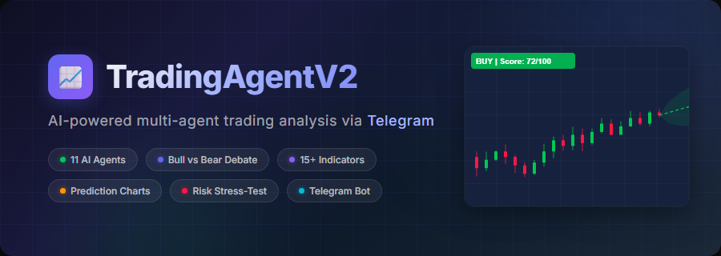
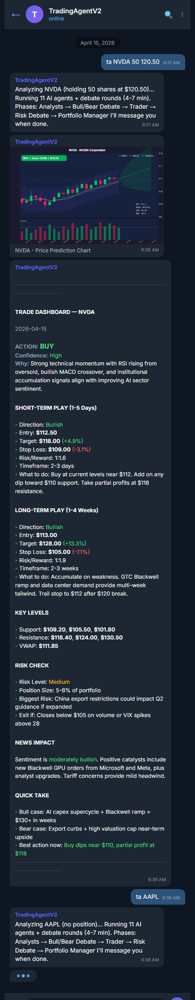
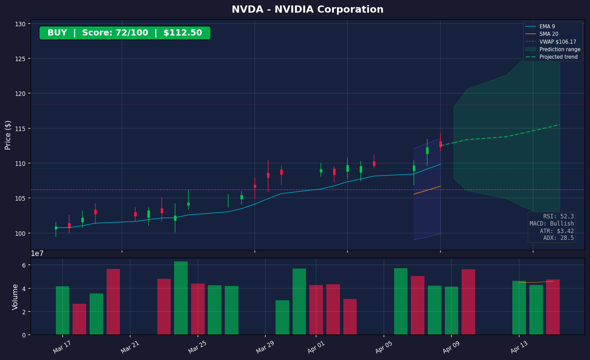
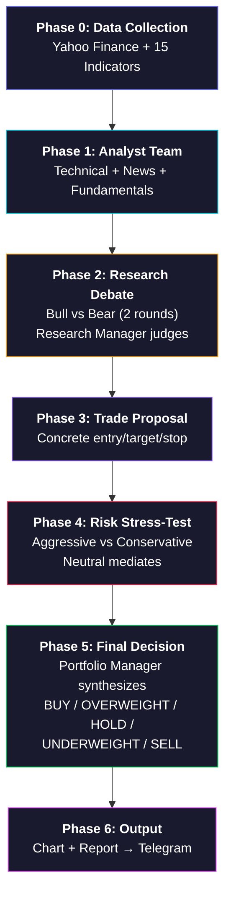

<p align="center">
  
</p>

<p align="center">
  <strong>11 AI agents debate your trades before you enter them.</strong>
</p>

<p align="center">
  <a href="#quick-start"></a>
  <a href="LICENSE"></a>
  <a href="https://core.telegram.org/bots/api"></a>
  <a href="https://openai.com"></a>
  <a href="https://anthropic.com"></a>
  <a href="https://github.com/ranaroussi/yfinance"></a>
</p>

<p align="center">
  <a href="#how-it-works">How It Works</a> &nbsp;&bull;&nbsp;
  <a href="#quick-start">Quick Start</a> &nbsp;&bull;&nbsp;
  <a href="#telegram-demo">Demo</a> &nbsp;&bull;&nbsp;
  <a href="#technical-indicators">Indicators</a> &nbsp;&bull;&nbsp;
  <a href="#deploy-to-ubuntu">Deploy</a> &nbsp;&bull;&nbsp;
  <a href="#credits">Credits</a>
</p>
updated by Ashlp259
---

## Why DayTradeAgents?

Most trading bots give you a signal and expect you to trust it blindly. DayTradeAgents doesn't work that way.

It runs **11 specialized AI agents** through a structured debate &mdash; bull researchers argue against bear researchers, aggressive risk analysts challenge conservative ones, and a portfolio manager synthesizes the entire battle into a single, actionable trade plan with **specific entry, target, and stop-loss prices**.

The whole thing is delivered to your phone via **Telegram** in under 7 minutes. Chart included.

```
You:   ta NVDA 50 120.50
Bot:   BUY | Confidence: High | Entry: $112.50 | Target: $118.00 | Stop: $109.00
```

<br>

## Telegram Demo

<p align="center">
  
</p>

<details>
<summary><strong>See the prediction chart in detail</strong></summary>
<br>
<p align="center">
  
</p>

The chart includes candlesticks, EMA 9, SMA 20, Bollinger Bands, VWAP, support/resistance levels, Fibonacci retracements, volume analysis, and an **ATR-based prediction cone** color-coded by the agent's decision.
</details>

<br>

## How It Works

### The 6-Phase Pipeline

Every analysis runs **11 agents** through **6 phases** with ~15 LLM calls:



<details>
<summary><strong>Agent details (click to expand)</strong></summary>

| # | Agent | Model Tier | Role |
|---|-------|-----------|------|
| 1 | Technical Analyst | Deep | Chart patterns, momentum, key levels |
| 2 | News Analyst | Quick | Headline sentiment, catalysts |
| 3 | Fundamentals Analyst | Quick | Valuation, financial health |
| 4 | Bull Researcher | Deep | Opening bull case + rebuttal |
| 5 | Bear Researcher | Deep | Opening bear case + counter |
| 6 | Research Manager | Deep | Judges full debate transcript |
| 7 | Trader | Quick | Converts verdict to trade proposal |
| 8 | Aggressive Risk Analyst | Quick | Champions the opportunity |
| 9 | Conservative Risk Analyst | Quick | Highlights hidden dangers |
| 10 | Neutral Risk Analyst | Quick | Finds balanced middle ground |
| 11 | Portfolio Manager | Deep | Final BUY/SELL/HOLD + strategy |

</details>

### What You Get Back

Every analysis produces:

| Output | Details |
|--------|---------|
| **Decision** | BUY / OVERWEIGHT / HOLD / UNDERWEIGHT / SELL with confidence level |
| **Short-term play** | 1-5 day strategy with entry, target, stop-loss, risk/reward ratio |
| **Long-term play** | 1-4 week strategy with entry, target, stop-loss |
| **Key levels** | Support, resistance, VWAP |
| **Risk assessment** | Risk level, position sizing, max loss, exit rules |
| **News impact** | Sentiment summary with key catalysts |
| **Prediction chart** | Candlestick chart with indicators + ATR forecast cone |

<br>

## Quick Start

### Prerequisites

- Python 3.10+
- An [OpenAI](https://platform.openai.com/api-keys) or [Anthropic](https://console.anthropic.com/) API key
- A Telegram bot token (from [@BotFather](https://t.me/BotFather))

### 1. Clone & configure

```bash
git clone https://github.com/Zhaor3/DayTradeAgents.git
cd DayTradeAgents
cp .env.example .env
```

Edit `.env` with your keys:

```env
LLM_PROVIDER=openai
OPENAI_API_KEY=sk-your-key-here
LLM_MODEL_QUICK=gpt-5-mini
LLM_MODEL_DEEP=gpt-5.2

TELEGRAM_BOT_TOKEN=your-bot-token
TELEGRAM_CHAT_ID=your-chat-id
```

> **Tip:** Get your chat ID by messaging [@userinfobot](https://t.me/userinfobot) on Telegram.

### 2. Install & run

```bash
python3 -m venv venv
source venv/bin/activate  # Windows: venv\Scripts\activate
pip install -r requirements.txt
python telegram_bot.py
```

### 3. Start trading

Open Telegram and send:

```
ta NVDA              → Analyze with no position
ta NVDA 50 120.5     → Analyze holding 50 shares at $120.50 avg
/status              → Check bot is alive
/help                → Show commands
```

<br>

## Technical Indicators

All computed locally from yfinance data &mdash; no paid API needed:

| Category | Indicators |
|----------|-----------|
| **Trend** | MACD (12/26/9), EMA 9/21 Cross, SMA 10/20/50/200 |
| **Momentum** | RSI (14), Stochastic %K/%D, ROC (12), OBV |
| **Volatility** | ATR (14), Bollinger Bands (20, 2&sigma;) |
| **Levels** | Support/Resistance, Fibonacci (38.2%, 50%, 61.8%), VWAP |
| **Strength** | ADX (14), Volume Ratio, RSI Divergence |
| **Composite** | **Signal Alignment Score** (-100 to +100) |

The **Signal Alignment Score** is a weighted composite that runs before any LLM call, providing an objective baseline that reduces narrative bias from language models.

<br>

## LLM Configuration

Two model tiers keep costs reasonable while maintaining quality:

| Tier | Default (OpenAI) | Default (Anthropic) | Used By |
|------|------------------|--------------------:|---------|
| **Deep** | `gpt-5.2` | `claude-sonnet-4-20250514` | Technical, Research Debate, Risk Advisor, Portfolio Manager |
| **Quick** | `gpt-5-mini` | `claude-sonnet-4-20250514` | News, Fundamentals, Trader, Risk Debate, Report Formatting |

Set `LLM_PROVIDER=openai` or `LLM_PROVIDER=anthropic` in `.env` to switch.

<br>

## Deploy to Ubuntu

One-command setup with **systemd** for auto-start on boot:

```bash
git clone https://github.com/Zhaor3/DayTradeAgents.git ~/DayTradeAgents
cd ~/DayTradeAgents
nano .env                  # Add your API keys
chmod +x setup_ubuntu.sh
./setup_ubuntu.sh
```

The script installs Python, creates a venv, installs dependencies, and registers a systemd service.

```bash
sudo systemctl start tradingagentv2      # Start
sudo systemctl status tradingagentv2     # Check status
tail -f ~/DayTradeAgents/bot.log         # Live logs
sudo systemctl restart tradingagentv2    # Restart
```

<br>

## Project Structure

```
DayTradeAgents/
├── main.py                           # CLI interface
├── telegram_bot.py                   # Telegram bot (production)
├── config.py                         # Settings from .env
├── setup_ubuntu.sh                   # One-click Ubuntu deployment
├── requirements.txt                  # 8 dependencies
│
├── tradingagent/
│   ├── agents/
│   │   ├── llm_client.py             # OpenAI / Anthropic abstraction
│   │   ├── pipeline.py               # 6-phase orchestrator
│   │   ├── technical_analyst.py      # Chart & momentum analysis
│   │   ├── news_analyst.py           # Headline sentiment
│   │   ├── fundamentals_analyst.py   # Valuation analysis
│   │   ├── bull_researcher.py        # Bull case + rebuttal
│   │   ├── bear_researcher.py        # Bear case + counter
│   │   ├── research_manager.py       # Debate judge
│   │   ├── trader.py                 # Trade proposal
│   │   ├── risk_aggressive.py        # Opportunity champion
│   │   ├── risk_conservative.py      # Danger highlighter
│   │   ├── risk_neutral.py           # Risk mediator
│   │   └── portfolio_manager.py      # Final decision maker
│   ├── data/
│   │   ├── market_data.py            # Yahoo Finance data fetcher
│   │   └── indicators.py             # 15+ technical indicators
│   ├── charts/
│   │   └── price_chart.py            # Prediction chart generator
│   └── report.py                     # Rich CLI formatter
```

<br>

## Compared to TradingAgents

Built on the ideas from [TradingAgents by Tauric Research](https://github.com/TauricResearch/TradingAgents), re-engineered for practical day trading:

| | TradingAgents | DayTradeAgents |
|-|--------------|---------------|
| **Focus** | General investment | Day trading (1-5d + 1-4w) |
| **Delivery** | CLI / LangGraph | Telegram bot + CLI |
| **Framework** | LangGraph + Redis + LangChain | Lightweight (direct API calls) |
| **Dependencies** | 20+ packages | 8 packages |
| **Setup** | Complex | One script |
| **Position tracking** | No | Yes |
| **Local indicators** | Limited | 15+ built-in |
| **Data sources** | Price + News | + Options, Insider, Earnings, VIX |
| **Signal Score** | No | Composite -100 to +100 |
| **Prediction chart** | No | Candlestick + ATR cone |
| **Rating scale** | 3-level | 5-level |
| **Lines of code** | ~5,000+ | ~2,200 |

<br>

## Roadmap

- [x] Multi-agent debate pipeline (11 agents, 6 phases)
- [x] 15+ technical indicators computed locally
- [x] ATR-based prediction chart with forecast cone
- [x] Telegram bot with position-aware analysis
- [x] OpenAI + Anthropic support
- [x] One-command Ubuntu deployment
- [ ] Portfolio-level analysis (correlations across holdings)
- [ ] Memory system for past trade outcomes
- [ ] Backtesting against historical data
- [ ] Webhook mode for faster Telegram responses
- [ ] Multi-user support with authentication

<br>

## Contributing

Contributions are welcome! Feel free to open an issue or submit a PR.

1. Fork the repo
2. Create a feature branch (`git checkout -b feature/awesome-thing`)
3. Commit your changes
4. Push and open a PR

<br>

## Credits

- Inspired by [TradingAgents](https://github.com/TauricResearch/TradingAgents) by [Tauric Research](https://github.com/TauricResearch) &mdash; the multi-agent debate architecture for financial analysis
- Market data from [Yahoo Finance](https://finance.yahoo.com/) via [yfinance](https://github.com/ranaroussi/yfinance)

## Disclaimer

> This is an AI-generated analysis tool for **informational and educational purposes only**. It is **not financial advice**. Always do your own research before making any trading decisions. Past performance does not guarantee future results. Trading involves significant risk of loss.

## License

[MIT](LICENSE)

---

<p align="center">
  If this project helped you, consider giving it a &#11088;
</p>
